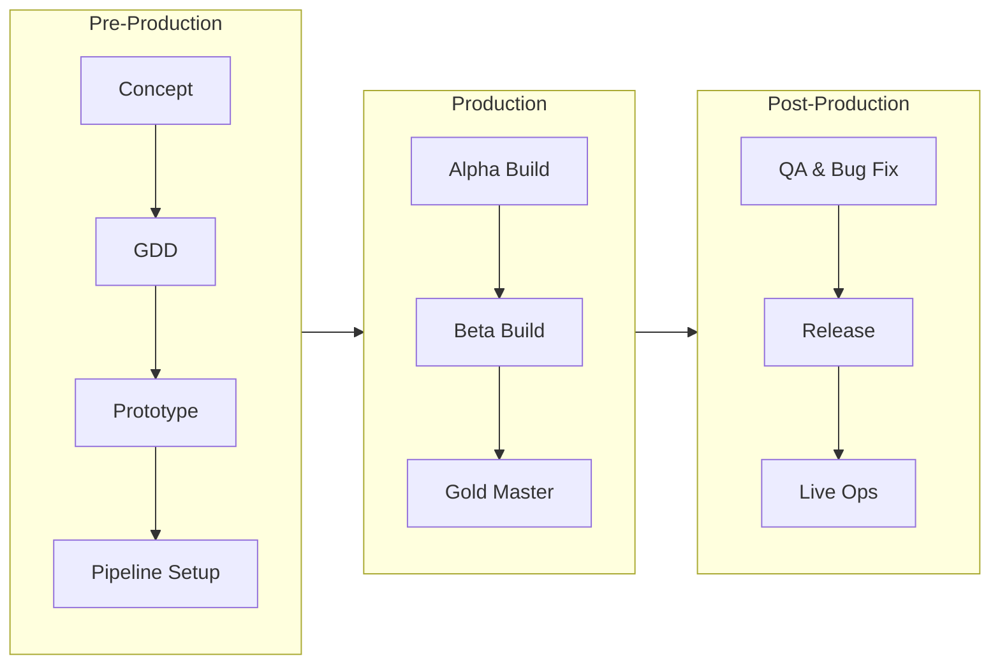
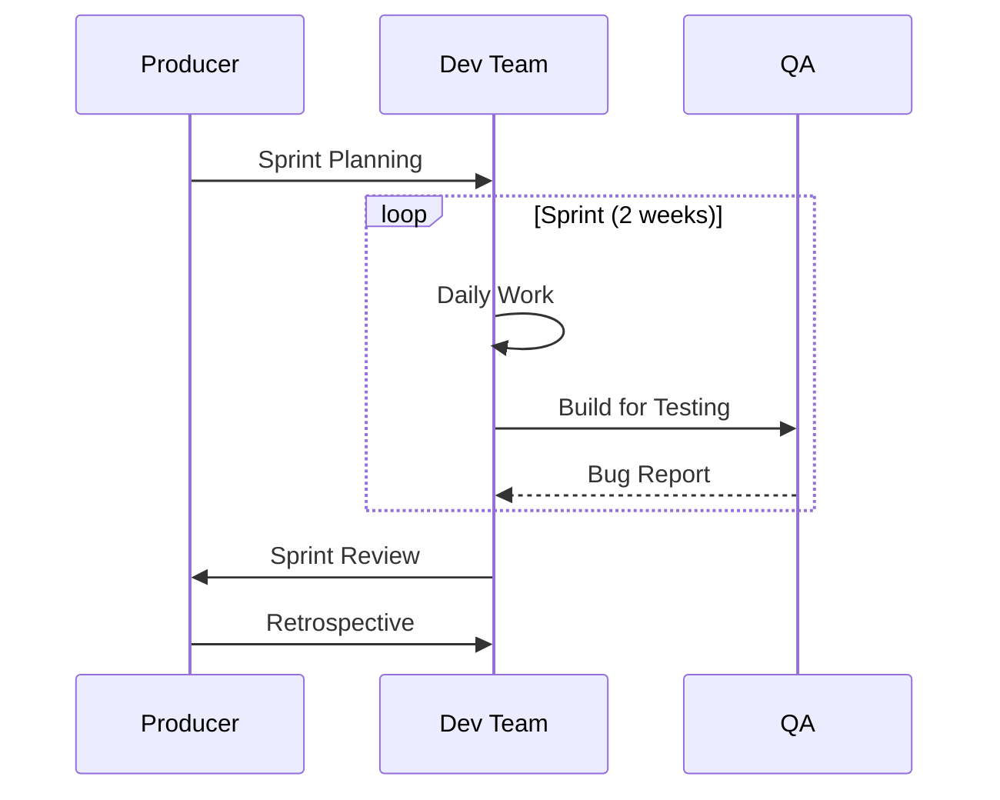
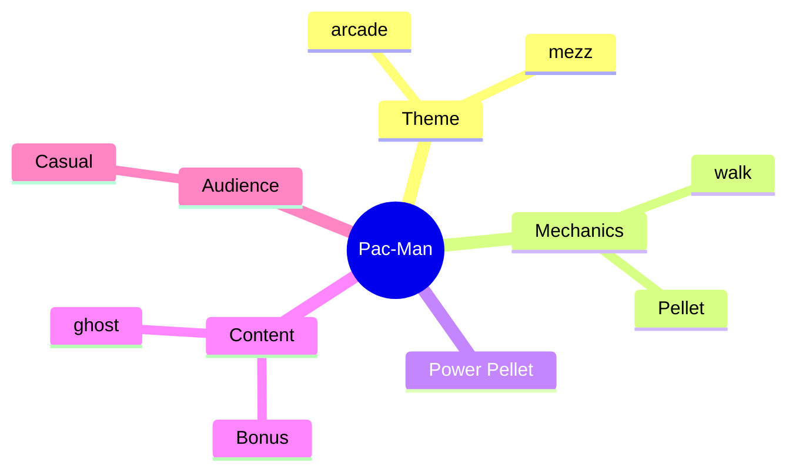
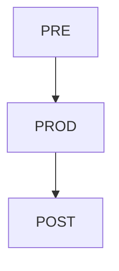
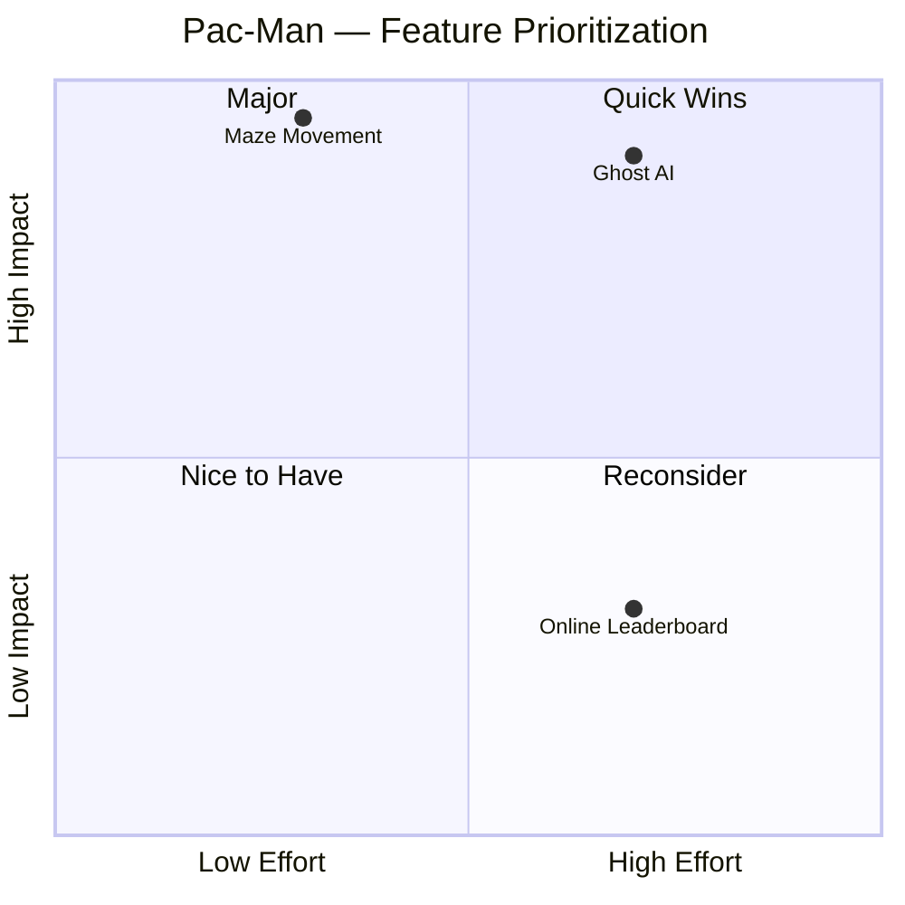
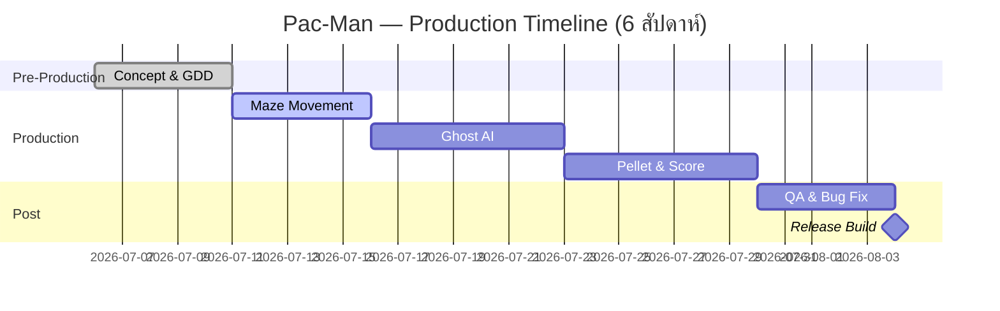

## Flow

```mermaid
flowchart LR 
 subgraph PRE["Pre-Production"]
   A[Concept] --> B[GDD]
   B --> C[Prototype]
   C --> D[Pipeline Setup]
 end 
  
 subgraph PROD["Production"]
   E[Alpha Build] --> F[Beta Build] 
   F --> G[Gold Master] 
 end

    subgraph POST["Post-Production"]
        H[QA & Bug Fix] --> I[Release] 
        I --> J[Live Ops] 
    end 
 
 PRE --> PROD --> POST 
```

sadfsdf

## Seq

```mermaid
sequenceDiagram 
    participant PO as Producer 
    participant Team as Dev Team 
    participant QA 
  
    PO->>Team: Sprint Planning 
    loop Sprint (2 weeks) 
        Team->>Team: Daily Work 
        Team->>QA: Build for Testing 
        QA-->>Team: Bug Report 
    end 
    Team->>PO: Sprint Review 
    PO->>Team: Retrospective 
```

## mindmap

```mermaid
mindmap
 root((Pac-Man))
  Theme 
   mezz
   arcade
  Mechanics 
   walk
   Pellet 
  Power Pellet 
  Content 
   ghost
   Bonus 
  Audience 
   Casual 
```

## flowchart

```mermaid
flowchart TD
    PRE --> PROD --> POST 
```

## quadrantChart

```mermaid
quadrantChart 
    title Pac-Man — Feature Prioritization 
    x-axis Low Effort --> High Effort 
    y-axis Low Impact --> High Impact 
    quadrant-1 Quick Wins 
    quadrant-2 Major 
    quadrant-3 Nice to Have 
    quadrant-4 Reconsider 
    Maze Movement: [0.3, 0.95] 
    Ghost AI: [0.7, 0.9] 
    Online Leaderboard: [0.7, 0.3] 
```

Comment: 

## gantt

```mermaid
gantt 
title Pac-Man — Production Timeline (6 สัปดาห์) 
dateFormat YYYY-MM-DD 
section Pre-Production 
Concept & GDD       :done,    c1, 2026-07-06, 5d 
section Production 
Maze Movement       :active,  p1, after c1, 5d 
Ghost AI            :         p2, after p1, 7d 
Pellet & Score      :         p3, after p2, 7d 
section Post 
QA & Bug Fix        :         q1, after p3, 5d 
Release Build       :milestone, m1, after q1, 0d 
```
